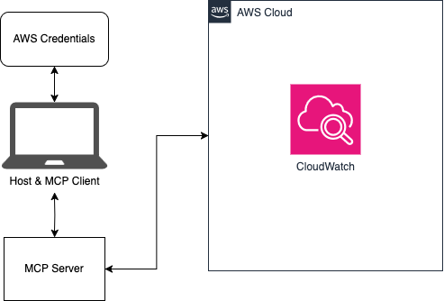

# Log Analyzer with MCP

A [Model Context Protocol (MCP)](https://modelcontextprotocol.io) server that provides AI assistants access to AWS CloudWatch Logs for analysis, searching, and correlation.

## 🏗️ Architecture

## 🔌 Model Context Protocol (MCP)

As outlined by Anthropic:
> MCP is an open protocol that standardizes how applications provide context to LLMs. Think of MCP like a USB-C port for AI applications. Just as USB-C provides a standardized way to connect your devices to various peripherals and accessories, MCP provides a standardized way to connect AI models to different data sources and tools.

This repository is an example client and server that allows an AI assistant like Claude to interact with CloudWatch logs in an AWS account. To learn more about MCP, read through the [introduction](https://modelcontextprotocol.io/introduction). 

## ✨ Features

- Browse and search CloudWatch Log Groups
- Search logs using CloudWatch Logs Insights query syntax
- Generate log summaries and identify error patterns
- Correlate logs across multiple AWS services
- AI-optimized tools for assistants like Claude

[Detailed feature list](./docs/features.md)

## 🚀 Installation

### Prerequisites

- The [uv](https://github.com/astral-sh/uv) Python package and project manager (includes `uvx`)
- An AWS account with CloudWatch Logs
- Configured [AWS credentials](./docs/aws-config.md)

## 🚦 Quick Start

1. Make sure to have configured your AWS credentials as [described here](./docs/aws-config.md)

2. Update your `claude_desktop_config.json` file with the proper configuration outlined in the [AI integration guide](./docs/ai-integration.md)

3. Open Claude for Desktop and start chatting!

For more examples and advanced usage, see the [detailed usage guide](./docs/usage.md).

## 🤖 AI Integration

This project can be easily integrated with AI assistants like Claude for Desktop. See the [AI integration guide](./docs/ai-integration.md) for details.

## 📚 Documentation

- [Detailed Features](./docs/features.md)
- [Usage Guide](./docs/usage.md)
- [AWS Configuration](./docs/aws-config.md)
- [Architecture Details](./docs/architecture.md)
- [AI Integration](./docs/ai-integration.md)
- [Troubleshooting](./docs/troubleshooting.md)

## 🔒 Security

See [CONTRIBUTING](CONTRIBUTING.md#security-issue-notifications) for more information.

## 📄 License

This project is licensed under the Apache-2.0 License.