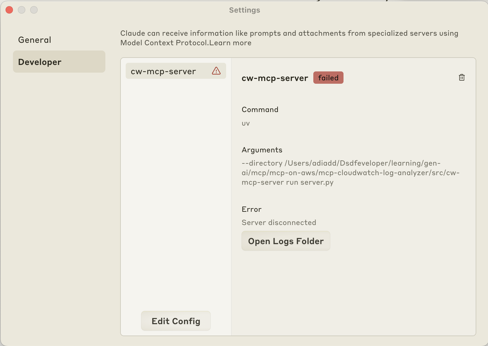

# 🔧 Troubleshooting Guide

There may be various issues you can run into while setting this up. Here are some tips on troubleshooting:

## ⚠️ Common Issues

**Server Disconnected**:
```
MCP cw-mcp-server: Server Disconnected.
```
1. Ensure your json file in the [ai integration guide](./ai-integration.md) is configured properly.
2. Ensure you've set up your AWS credentials properly according to the [aws configuration](./aws-config.md)

**Authentication Errors**:
```
Error: An error occurred (AccessDenied) when calling the DescribeLogGroups operation: Access denied
```
Ensure your AWS credentials are properly configured and have the necessary permissions to access CloudWatch Logs:

1. Check if your credentials file exists:
   ```bash
   cat ~/.aws/credentials
   ```

2. Verify you have the required permissions (CloudWatchLogsReadOnlyAccess) for the assumed role you are using.

3. If using temporary credentials, ensure your session token is included in your `~/.aws/credentials` file:
   ```ini
   [profile-name]
   aws_access_key_id = your-temp-access-key
   aws_secret_access_key = your-temp-secret-key
   aws_session_token = your-session-token
   ```

4. Test your credentials directly with AWS CLI:
   ```bash
   aws cloudwatch list-metrics --namespace AWS/Logs
   ```

**Resource Not Found**:
```
Error: An error occurred (ResourceNotFoundException) when calling the GetLogEvents operation
```
Check that the log group and stream names are correct. Log stream names are case sensitive.

**Connection Issues**:
```
Error: Failed to connect to MCP server
```
Verify that the server is running and accessible. Check file paths in your `claude_desktop_config.json` or client configuration.

**Query Timeout**:
```
"status": "Timeout", "error": "Search query failed to complete"
```
For complex queries or large log volumes, try reducing the time range using the `--hours` parameter.

**Claude terminating request**:

This could be due to a query timeout or invalid response from CloudWatch (for example: performing operations on a non-existent log group). 

In this case, try checking the server logs as outlined in the settings



then, click on the `Open Logs Folder` and open the `mcp-server-cw-mcp-server.log` file to see more details. 

**Amazon Q CLI terminating request**:

if you have issues with your configuration, then Amazon Q CLI will start (without any MCP Server Tools) with an error similar to:
```
WARNING: Error reading global mcp config: expected value at line 9 column 19
Please check to make sure config is correct. Discarding.
```
You might also see timeout issues if it is struggling to find and download the details you have configured in your mcp.json, for example:
```
x mcp_server has failed to load:
- Operation timed out: recv for initialization
- run with Q_LOG_LEVEL=trace and see $TMPDIR/qlog for detail
x 0 of 1 mcp servers initialized
```
You can go to `$TMPDIR/qlog` to find various logs generated, and you can configure Q_LOG_LEVEL with either trace, debug, info, and warn configurations to get debug output to help you troubleshoot any issues you might run into.


## 🆘 Getting Help

If you encounter issues not covered in this troubleshooting section, please:

1. Check the server logs for detailed error messages
2. Verify your AWS permissions and configuration

If you're still facing issues, please open a GitHub Issue.
